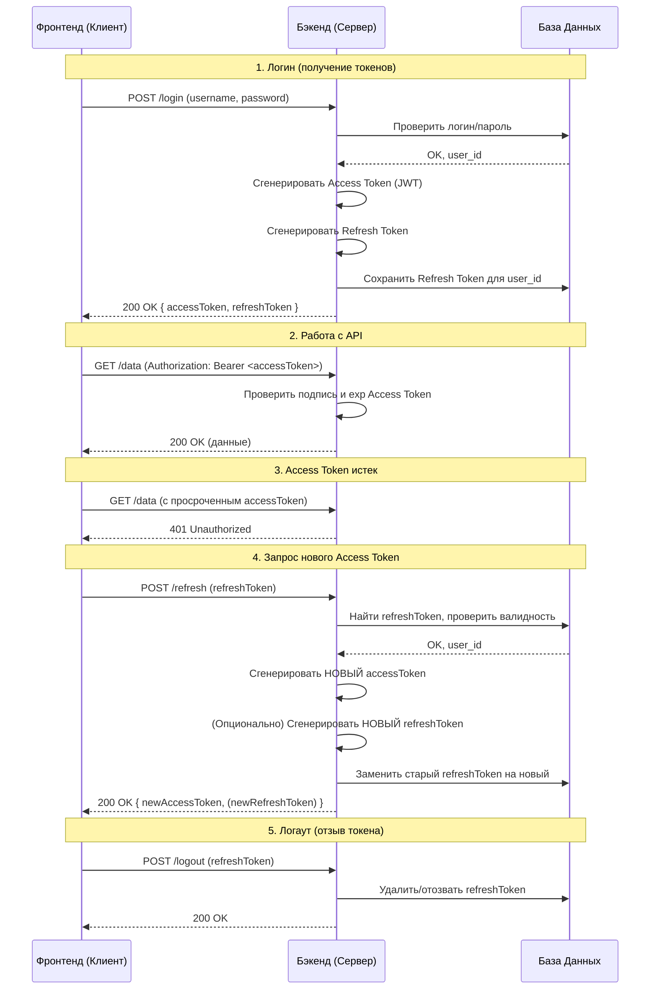

### Основная концепция: "Пропуск" и "Ключ для перевыпуска"

Представьте себе систему безопасности в офисе:

1.  **Access Token** — это **пропуск**. Он у вас в кармане, вы предъявляете его охране (серверу) каждый раз, когда хотите пройти в определенный кабинет (получить доступ к ресурсу). Он действует недолго (минуты/часы).
2.  **Refresh Token** — это **ключ от комнаты, где выдают эти пропуска**. Он хранится у вас в сейфе (на клиенте, в безопасном месте). Когда ваш пропуск (Access Token) просрочился, вы используете ключ (Refresh Token), чтобы получить новый пропуск, *не вводя логин и пароль заново*.

---

### 1. Логика работы и последовательность (Flow)

Типичная последовательность выглядит так:

**Шаг 1: Первоначальная аутентификация**
*   Пользователь вводит логин и пароль на фронтенде.
*   Фронтенд отправляет их на бэкенд (например, на эндпоинт `/auth/login`).
*   Бэкенд проверяет учетные данные.

**Шаг 2: Генерация и выдача токенов**
*   Если логин/пароль верные, бэкенд:
    1.  **Генерирует Access Token (JWT)**. Он содержит в себе payload (например, `user_id`, `roles`, `exp` - время истечения). Подписывается секретным ключом сервера.
    2.  **Генерирует Refresh Token**. Обычно это тоже JWT, но более длительный и хранящийся в БД. Или это может быть случайная строка (opaque token).
    3.  **Сохраняет Refresh Token в базе данных (БД)**, привязав его к конкретному пользователю (`user_id`). Часто также сохраняют дату выдачи, срок действия и можно ли им еще пользоваться (не отозван ли он).
*   Бэкенд отправляет **оба токена** фронтенду в теле ответа.

**Шаг 3: Работа пользователя с Access Token**
*   Фронтенд сохраняет оба токена (обычно в `localStorage` или, что безопаснее, в `httpOnly` cookie).
*   При каждом запросе к защищенному API (например, `GET /api/profile`) фронтенд добавляет Access Token в заголовок `Authorization: Bearer <access_token>`.
*   Бэкенд проверяет подпись Access Token и его срок действия (`exp`). Если все valid — возвращает запрошенные данные.

**Шаг 4: Истечение срока действия Access Token**
*   Рано или поздно Access Token истекает.
*   Фронтенд делает запрос к API, но бэкенд отвечает ошибкой **`401 Unauthorized`**.

**Шаг 5: Использование Refresh Token для получения нового Access Token**
*   Фронтенд ловит ошибку 401.
*   Вместо того чтобы заставлять пользователя логиниться снова, фронтенд отправляет запрос на специальный эндпоинт (например, `/auth/refresh`), передавая в теле или в заголовке **Refresh Token**.
*   **Важный момент:** Access Token при этом *не отправляется* (он ведь уже невалиден).

**Шаг 6: Валидация Refresh Token на бэкенде**
*   Бэкенд получает Refresh Token и делает **несколько критических проверок**:
    1.  **Проверяет подпись** (если это JWT) или **ищет его в БД**.
    2.  **Проверяет, не истек ли его срок действия** (у Refresh Token'а он гораздо дольше — дни, недели, месяцы).
    3.  **Проверяет, не отозван ли он** (соответствует ли он тому, что лежит в БД для этого пользователя).
*   Если все проверки пройдены:
    1.  Бэкенд **генерирует новый Access Token** (и, опционально, *новый Refresh Token*).
    2.  **Обновляет запись в БД**: старый Refresh Token помечается как недействительный и заменяется на новый (это практика "ротации" токенов, повышающая безопасность).
    3.  Отправляет новые токены фронтенду.
*   Если проверки не пройдены (токен не найден в БД, истек или отозван) — возвращается ошибка `403 Forbidden`. Это означает, что пользователю нужно пройти аутентификацию заново.

**Шаг 7: Продолжение работы**
*   Фронтенд получает новые токены, сохраняет их и повторяет оригинальный запрос к API с новым Access Token.

**Шаг 8: Выход (Logout)**
*   При logout'е фронтенд отправляет запрос на бэкенд (например, `/auth/logout`).
*   Бэкенд **удаляет/помечает как недействительный** Refresh Token этого пользователя из БД.
*   После этого использовать этот Refresh Token для получения новых Access Token'ов будет невозможно.

---

### 2. Что и куда отдается? (База данных vs Фронтенд)

| Токен | Где хранится на сервере? | Что отдается фронтенду? | Для чего нужен фронтенду? |
| :--- | :--- | :--- | :--- |
| **Access Token** | **Не хранится в БД** (является stateless JWT). Его валидность проверяется только по подписи и дате `exp`. | **Отдается.** Хранится на клиенте. | Передавать в заголовке каждого запроса к защищенному API. |
| **Refresh Token** | **Хранится в БД** в специальной таблице (напр., `user_refresh_tokens`), связанной с `user_id`. | **Отдается.** Хранится на клиенте в безопасном месте. | Использовать для получения новой пары токенов, когда Access Token истек. |

**Связь между ними:** Связь осуществляется через базу данных. Refresh Token в БД — это "якорь", который подтверждает, что сессия пользователя все еще активна и он имеет право получать новые Access Token'ы.

---

### 3. Схема взаимодействия

### 4. Зачем такие сложности? Преимущества

1.  **Безопасность:** Access Token живет недолго. Если его украдут (перехватят), злоумышленник сможет использовать его очень недолгое время.
2.  **Stateless-сервер:** Бэкенду не нужно хранить в памяти сессии или Access Token'ы, что упрощает масштабирование. Валидация Access Token происходит только через проверку подписи JWT.
3.  **Удобство пользователя:** Пользователь не должен вводить логин и пароль каждые 15 минут. Сессия остается активной долгое время (пока жив Refresh Token), но безопасность при этом не страдает.

### Итог

*   **Access Token** — короткоживущий ключ для доступа к данным. Не хранится в БД.
*   **Refresh Token** — долгоживущий ключ для перевыпуска. Хранится в БД и привязан к пользователю.
*   **Фронтенд** получает оба, использует Access Token для запросов, а Refresh Token — для его обновления.
*   **Бэкенд** проверяет Access Token "в слепую" (по подписи), а валидность Refresh Token сверяет с базой данных.

Эта схема является золотым стандартом для SPA (React, Vue.js) и мобильных приложений.